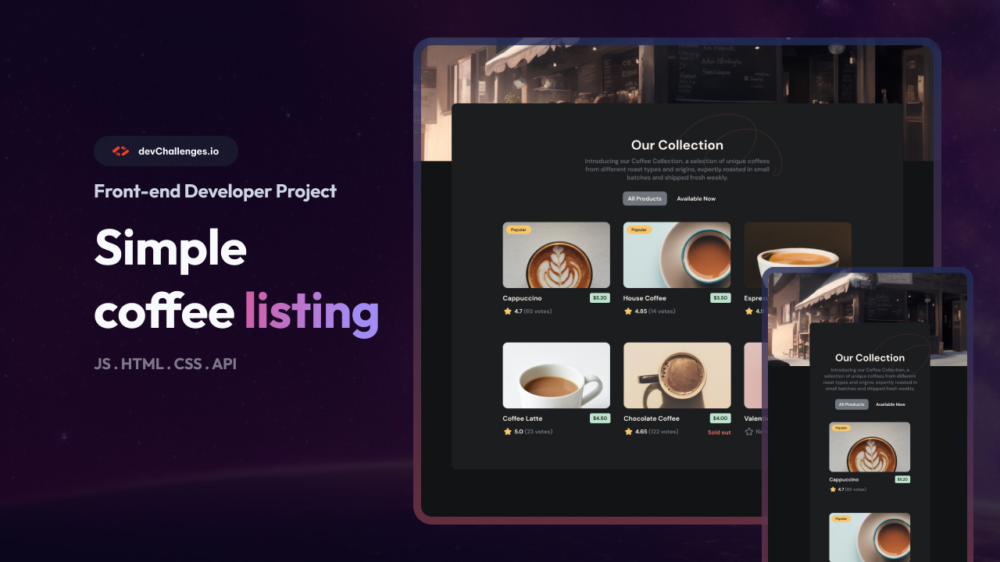

# ☕ Coffee Listing

## Welcome! 👋

This is a responsive coffee listing page built as part of a front-end coding challenge on [devChallenges.io](https://devchallenges.io/).

---

## 🔧 Project Goals & Features

- Build a coffee listing page.
- Create a reusable Card component that includes:
  - Coffee image
  - Name
  - Price
  - Rating and votes (if available)
  - Conditionally display "Popular" and "Available" tags
- Render coffee items from a provided JSON or API.
- Allow users to filter between:
  - All products
  - Available products only
